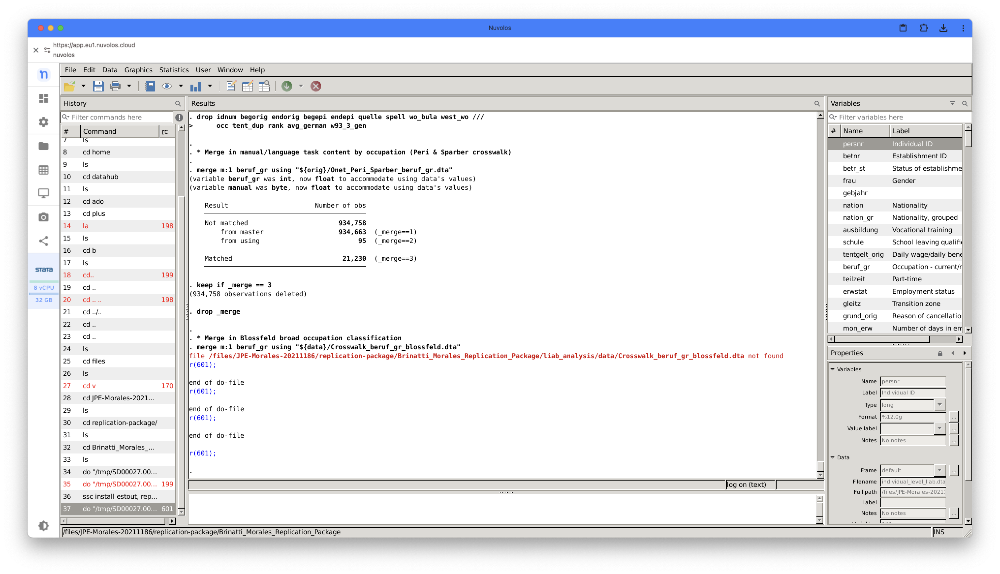
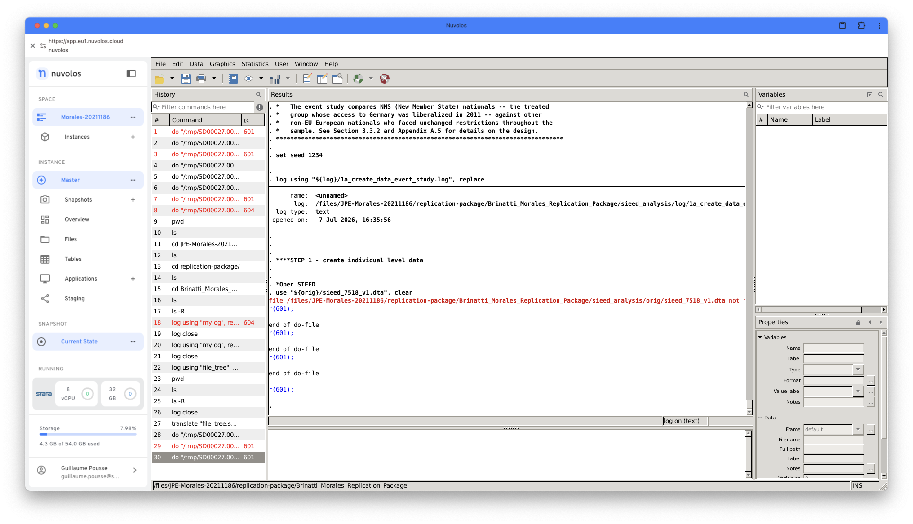
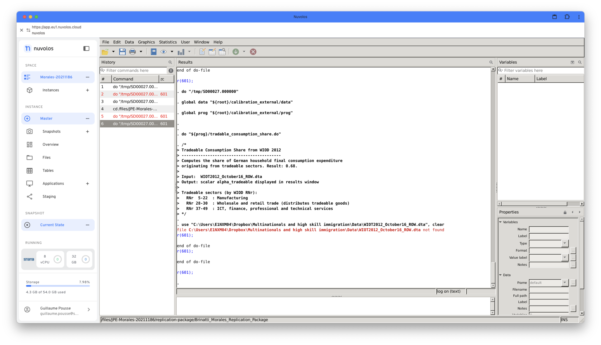

# Paper Identification

|           |                      |
|-----------|----------------------|
| ID        |  |
| Author    |    |
| Title     |     |
| Iteration |     |

Some useful information up front:

-   [JPE Data and Code Availability Policy](https://www.journals.uchicago.edu/journals/jpe/datapolicy)
-   [Step by step guidance from Data Editor for Authors](https://jpedataeditor.github.io/)
-   [Template README](https://social-science-data-editors.github.io/template_README/)

# Summary

In assessing compliance with our [Data and Code Availability Policy](https://www.journals.uchicago.edu/journals/jpe/datapolicy), our reproducibility team has identified the following issues, which we ask you to address:

1.  Please add data citations for all raw data sets you use in both readme and paper. [Here](https://social-science-data-editors.github.io/guidance/Guidance/Data_citation_guide.html) is some guidance.
2.  There are some missing datasets which prevent the reproduction of some exhibits. Please investigate.
3.  In your readme please provide a table pointing out exactly which exhibits can and which cannot be reproduced courtesy of your confidential data use.
4.  Please add precise instructions of how to gain access to your confidential data (point of contact, time and monetary cost, etc)

# General

-   [x] Data Availability and Provenance Statements
    -   [x] Statement about Rights - Part 1: Right to use the data (e.g. *did the authors lawfully obtain the data*)
    -   [x] Statement about Rights - Part 2: Right to publish the data (e.g. *are human subjects involved and did permission been granted to publish their data?*)
    -   [x] License for Data (optional, but recommended)
    -   [x] Details on each Data Source
-   [x] Dataset list
-   [x] Computational requirements
    -   [x] Software Requirements
    -   [x] Controlled Randomness (as necessary)
    -   [x] Memory, Runtime, and Storage Requirements
-   [x] Description of programs/code
    -   [ ] License for Code (Optional, but recommended)
-   [x] List of tables and programs
-   [x] References (Optional, but recommended)

# High-level Description of Research Project

*This research project...*

-   [x] uses observational data.
-   [x] uses *confidential* observational data.
-   [ ] uses data generated via experiment or trial by the authors (in field or lab).
    -   [ ] For lab experiments: The code to implement the experimental protocol (z-Tree, o-Tree etc) is included in the package.
    -   [ ] A PDF copy of IRB approval is contained in the package.
    -   [ ] A PDF document outlining the design of the experiment, including information on the selection and eligibility of participants is included.
    -   [ ] A PDF copy of the instructions given to participants in both original language and an English translation is included.
-   [ ] uses data generated via survey by the authors (in field or online)
    -   [ ] The programs used to administer the survey (e.g. qualtrics survey file) are included.
    -   [ ] A PDF copy of IRB approval is contained in the package.
    -   [ ] A PDF of the original questionaire(s) and information on the selection and eligibility of participants is included.
-   [ ] is a simulation study: the data are generated by an algorithm.
-   [ ] is a numerical illustration: no data are used but code is used to produce illustrative output (tables, figures)

# Data description

For any data that cannot be provided as part of the replication package, please provide the following information as part of the README.

> {REQUIRED} Please specify how long the data will be preserved in the restricted-access location.

> {REQUIRED} Please provide affirmation of support for replication checks. - As per the [JPE policy](https://jpedataeditor.github.io/policy.html), "In cases where data cannot be published in an openly accessible trusted data repository like the JPE dataverse, authors who have requested an exemption to publish them at the time of first submission must commit to preserving the data and code for a period of no less than five years following the publication of the paper. They should also provide reasonable assistance to requests for clarification and replication."

> {REQUIRED} Please provide a codebook for the data. - The codebook should at a minimum describe the variables obtained from the data source, in a manner that will let others verify that they have obtained a substantially similar dataset if successfully obtaining access to the data.

## Data Sources

| file/name | public | private | DOI/URL | Access described | cited readme | cited paper |
|-----------|-----------|-----------|-----------|-----------|-----------|-----------|
| liab_lm_9314_v1_pers.dta (LIAB LM 9314) | no | yes | <https://fdz.iab.de> | yes | no | no |
| liab_lm_9314_v1_bhp_basis_v1.dta (LIAB LM 9314) | no | yes | <https://fdz.iab.de> | yes | no | no |
| iabbp\_<year>.dta (IAB Establishment Panel, 2004–2012) | no | yes | <https://fdz.iab.de> | yes | no | no |
| SIEED_7518_v1.dta | no | yes | <https://fdz.iab.de> | yes | no | no |
| SIEED_7518_v1_bhp_basis_v1.dta | no | yes | <https://fdz.iab.de> | yes | no | no |
| cpigermany.dta (Destatis CPI) | yes | no | <https://www-genesis.destatis.de/datenbank/online/statistic/61111/table/61111-0001> | partial | no | no |
| local labor markets.dta (Kropp & Schwengler concordance) | yes (shipped) | no | \- | no | no | yes (article, not data citation) |
| Onet_Peri_Sparber_beruf_gr.dta | yes | no | <https://www.aeaweb.org/articles?id=10.1257/app.1.3.135> | partial | no | yes (article, not data citation) |
| Validation_data.xlsx (aggregated IAB moments) | yes (shipped) | no | \- | partial | no | no |
| World Bank WDI series (SL.GDP.PCAP.EM.KD, SP.POP.1564.TO, NY.GDP.PCAP.PP.CD, SP.POP.TOTL) | yes | no | <https://data.worldbank.org> | yes | no | no |
| WIOT2012_October16_ROW.dta (WIOD 2012 release) | yes (shipped) | no | \- | no | no | yes (article, not data citation) |
| OECD CSVs (wages, hours, GDP, dependent employees, Germany 2019) | yes (shipped) | no | \- | partial | no | no |

# Requirements

-   [x] README is in TXT, MD, or PDF format
-   [x] README is accessible at the root of the package (not inside a folder)
-   [ ] Title conforms to guidance (starts with "Data and Code for: Title of Paper" or "Code for: Title of Paper", is properly capitalized)
-   [ ] Authors (with affiliations) are listed in the same order as on the paper

> {REQUIRED} Please review the title of the deposit as per our guidelines.

> {REQUIRED} Please review authors and affiliations on the deposit. In general, they are the same, and in the same order, as for the manuscript; however, authors can deviate from that order.

## Stated Requirements

-   [ ] No requirements specified

-   [x] Software Requirements specified as follows:

    *"3.1 STATA - Stata 16 or later. (liab_analysis/prog/master.do declares `version 16`.) - User-written packages (install once from SSC):*

    *ssc install reghdfe // high-dimensional fixed-effects regression*

    *ssc install ivreghdfe // IV/2SLS version of reghdfe*

    *ssc install ftools // dependency of reghdfe/ivreghdfe*

    *ssc install estout // eststo / esttab / estout table export*

    *ssc install grstyle // graph styling (model_analysis plots only)*

    *ssc install grc1leg2 // graph styling (model_analysis plots only)*

    *ivreghdfe additionally relies on ivreg2 and ranktest; if ssc install ivreghdfe does not pull them in, install them as well: ssc install ivreg2 ssc install ranktest*

    *The do-files in calibration_external/ use base Stata only (import Excel, merge, collapse) and require none of the above.*

    *Also, make sure to add the ado files bartik_weight.ado, btsls.ado, and ch_weak.ado, which are not available via ssc install. The codes can be downloaded directly at <https://github.com/paulgp/bartik-weight/tree/master/code>*

    *3.2 MATLAB - MATLAB (R2019b or later recommended) with the Optimization Toolbox. The model solution and calibration use fsolve and fminsearch; the nu-estimation helper files in liab_analysis/prog use fsolve and gamma(). - No additional MATLAB toolboxes are required. "*

-   [ ] Computational Requirements specified as follows:

    -   Cluster size, etc.

-   [x] Time Requirements specified as follows:

    -   *"Run time is data-dependent. The empirical part of the model takes close to 5 hours to run on the full data. On the genuine FDZ data, the bootstrap-based do-files (5,000 firm-clustered draws) and the model calibration (SMM via fminsearch) are the slow steps."*

-   [ ] Requirements are complete.

For missing requirements, see the list of required changes in @sec-findings

# Analyzing Data and Code Files











## Code description

There are 34 `.do` files. 1 master file at the root, 1 fileint he calibration_external folder, 20 for the liab_analysis, 7 for the sieed_analysis, 1 for the model_analysis, and 4 for the stat_plots. 

There are 50 `.m` files. 1 master file int he model_analysis, 2 files in the liab_analysis, 1 to export the latex tables, 19 for the heterogeneous-firm model, 15 for the homogeneous (within-sector) model, and 12 for the policy counterfactuals.

The below table presents programs which produce figures or tables.

| Exhibit | Folder | Program |
|---|---|---|
| Table 1 | liab_analysis | 19_moments_calculation.do |
| Table 1 (model side) / Table 2 | model_analysis | code/model/Export_latex_tables.m |
| Tables A1, A2 | liab_analysis | 17_empirical_facts.do |
| Tables A3–A5 | sieed_analysis | 2a_results_event_studies.do |
| Tables A6–A8 | liab_analysis | 18_immigrant_comparative_advantage.do |
| Table C1 | liab_analysis | 10_epsilon_estimation.do |
| Tables C2, C4 | liab_analysis | 15_epsilon_shift_share.do |
| Table C3 | liab_analysis | 11_epsilon_pre_trend_test.do |
| Table C5 | liab_analysis | 12_epsilon_firm_characteristics.do |
| Table C6 | liab_analysis | 16_estimate_nu.do (+ MATLAB nu files) |
| Table C7 | liab_analysis / model_analysis | 19_moments_calculation.do / Export_latex_tables.m |
| Tables C8–C13 | liab_analysis | 8_validation_regressions.do |
| Tables D1–D3 | model_analysis | code/model/Export_latex_tables.m |
| Kappa (Appendix C.1) | liab_analysis | 9_kappa_estimation.do |
| Figure 1 | liab_analysis | 17_empirical_facts.do |
| Figure 2 | sieed_analysis | 2a_results_event_studies.do |
| Figure 3 | liab_analysis / model_analysis | 8_validation_regressions.do / master.do (Validation_cross_CI_heterog.do) |
| Figure 4 | model_analysis | master.do (Counterfactual_plots_heterog.do) |
| Figures A1–A4, A6 | liab_analysis | 17_empirical_facts.do |
| Figure A5 | sieed_analysis | 2c_results_figA5.do |
| Figure A7 | sieed_analysis | 2b_results_figA7.do |
| Figure A8 | sieed_analysis | 2a_results_event_studies.do |
| Figure A9 | liab_analysis | 18_immigrant_comparative_advantage.do |
| Figure C1 | liab_analysis | 14_epsilon_sigma_histogram.do |
| Figures D1, D2 | model_analysis | master.do (Counterfactual_plots_policies.do) |
| Calibration moment GDP_RoW_Ger (~0.32) | calibration_external | gdp_per_worker_*.do |
| Calibration moment tradeable share (~0.68) | calibration_external | tradeable_consumption_share.do |



-   [x] The replication package contains a "main" or "master" file(s) which calls all other auxiliary programs.

> NOTE: In-text numbers that reference numbers in tables do not need to be listed. Only in-text numbers that correspond to no table or figure need to be listed.

## Computing Environment of the Replicator

Replication was conducted on a Nuvolos secure cloud environment.

Hardware information:

-   Mac Laptop M2 MacBook Air, MacOS 15.7.7, 16GB RAM, (M2 Processor, 8 cores)

Nuvolos Environment information:

-   Ubuntu 22.04.5 LTS (Linux), 2.5 TB free storage, 336 GiB available RAM, CPU: AMD EPYC 9354P, 64 CPUs (32 cores × 2 threads)

Nuvolos Softwares:

-   StataNow 19.5 MP, 4 CU 16GB RAM 
-   Matlab R2025b with Dynare 6.5 [Mathworks] using VNC

# Replication

Overall the script runs smoothly with some hiccups. 

-   Script `18_immigrant_comparative_advantage.do` does not run due to missing `Crosswalk_beruf_gr_blossfeld.dta`. 



-   All other .do files from the LIAB analysis run. 
-   The SIEED analysis does not run due to missing `sieed_7518_v1.dta` file. 



-   The cobb-douglas tradable share was not calibrated due to missing `WIOT2012_October16_ROW.dta` file. 



-   The structural model analysis runs.

**Note:** the master.do file has its sections labelled as follows:

Part 1: Change directory

Part 2: Install stata programs needed

Part 3: Analysis using LIAB

Part 2: Analysis using SIEED

Part 4: Calibrate the Cobb-Douglas tradable share

Part 5: Analysis using the structural model (model_analysis)
 
# Findings {#sec-findings}

## Missing Requirements

The following STATA programs also need to be installed: 

-   estout 
-   require 

Computational requirements (i.e. memory and storage) are not specified in the README. 

> \[REQUIRED\] Please amend README to contain complete requirements.

## Data Preparation Code

Examples:

-   Program `1-create-data.do` ran without error, output expected data
-   Program `2-create-appendix-data.do` failed to produce any output.

## Tables and Figures

| Exhibit | Folder | Program | Reproduced? | Comment |
|---|---|---|---|---|
| Table 1 | liab_analysis | 19_moments_calculation.do | yes | rounding discrepancy on the $\sigma_{\psi, f, NT}$ which equals 30.82 in the paper and 30.83 in the reproduced file. |
| Table 2 | model_analysis | code/model/Export_latex_tables.m | yes | - |
| Tables A1, A2 | liab_analysis | 17_empirical_facts.do | yes | values do not match, to be expected with the LIAB data|
| Tables A3–A5 | sieed_analysis | 2a_results_event_studies.do | no | missing `sieed_7518_v1.dta` |
| Tables A6–A8 | liab_analysis | 18_immigrant_comparative_advantage.do | no | missing `Crosswalk_beruf_gr_blossfeld.dta`|
| Table C1 | liab_analysis | 10_epsilon_estimation.do | yes | values do not match, to be expected with the LIAB data|
| Tables C2, C4 | liab_analysis | 15_epsilon_shift_share.do | yes | values do not match, to be expected with the LIAB data|
| Table C3 | liab_analysis | 11_epsilon_pre_trend_test.do | yes | values do not match, to be expected with the LIAB data|
| Table C5 | liab_analysis | 12_epsilon_firm_characteristics.do |  yes | values do not match, to be expected with the LIAB data|
| Table C6 | liab_analysis | 16_estimate_nu.do (+ MATLAB nu files) | yes | values do not match, to be expected with the LIAB data|
| Table C7 | liab_analysis / model_analysis | 19_moments_calculation.do / Export_latex_tables.m | yes | rounding discrepancies (paper vs reproduced file). $Var((1-s_j)/s_j)$, T: simulated 1.31 vs 1.32 $Var((1-s_j)/s_j)$, NT: simulated 1.43 vs 1.42 data 1.58 vs 1.59. $E(1-s_{j,p90})-E(1-s_{j,p50})$, T: simulated 0.027 vs 0.026. Share of firms hiring immigrants, T: simulated 0.62 vs 0.61.|
| Tables C8–C13 | liab_analysis | 8_validation_regressions.do | yes | values do not match, to be expected with the LIAB data|
| Tables D1–D3 | model_analysis | code/model/Export_latex_tables.m | yes | - |
| Kappa (Appendix C.1) | liab_analysis | 9_kappa_estimation.do | yes | values do not match, to be expected with the LIAB data|
| Figure 1 | liab_analysis | 17_empirical_facts.do | yes | structure matches, though values do not. To be exptected with the LIAB data. |
| Figure 2 | sieed_analysis | 2a_results_event_studies.do | no | missing `sieed_7518_v1.dta` |
| Figure 3 | liab_analysis / model_analysis | 8_validation_regressions.do / master.do (Validation_cross_CI_heterog.do) | no | structure does not match, see comment below |
| Figure 4 | model_analysis | master.do (Counterfactual_plots_heterog.do) | yes | -|
| Figures A1–A4, A6 | liab_analysis | 17_empirical_facts.do | yes | structure matches, though values do not. To be exptected with the LIAB data. |
| Figure A5 | sieed_analysis | 2c_results_figA5.do | no | missing `sieed_7518_v1.dta` |
| Figure A7 | sieed_analysis | 2b_results_figA7.do | no | missing `sieed_7518_v1.dta` |
| Figure A8 | sieed_analysis | 2a_results_event_studies.do | no | missing `sieed_7518_v1.dta` |
| Figure A9 | liab_analysis | 18_immigrant_comparative_advantage.do | no | missing `Crosswalk_beruf_gr_blossfeld.dta`|
| Figure C1 | liab_analysis | 14_epsilon_sigma_histogram.do | yes | structure matches, though values do not. To be exptected with the LIAB data. |
| Figures D1, D2 | model_analysis | master.do (Counterfactual_plots_policies.do) | yes | - |
| Calibration moment GDP_RoW_Ger (~0.32) | calibration_external | gdp_per_worker_*.do | no | calibration exercise did not run due to missing `WIOT2012_October16_ROW.dta`.|
| Calibration moment tradeable share (~0.68) | calibration_external | tradeable_consumption_share.do | no | calibration exercise did not run due to missing `WIOT2012_October16_ROW.dta`.|

Comment on the structure of Figure 3: 

-   Non-Tradable deciles malformed: decile 3 is missing entirely (jumps 2→4, only 9 deciles) and several bins have N=2, so NT can't form 10 plot points. Check on real data.
-   Values are raw, pre-normalization: log shows raw firm-mean elasticities; the paper's plotted values are normalized to 0 at decile 1 and rescaled (done downstream), so these won't line up with the figure even in shape.
-   Data-side only: the Model line in each panel comes from model_analysis, not this log. The `figure_3.png` in `model_analysis/output/figures/` is empty (0B file).

I copy the output from `8_validation_regressions.log`, for reference.

```stata
* Table C13 / Figure 3: Mean firm-level elasticity by size decile
. ****************************
. 
. * Variables: elast_lrev / elast_lrev_T / elast_lrev_NT (fitted revenue elasticity
. *   from 2SLS, evaluated firm-by-firm); elast_ratio / elast_ratio_T / elast_ratio_NT
. *   (fitted wage-bill ratio elasticity); decile_emp / decile_emp_T / decile_emp_NT
. *   (decile of log employment in 2003, defined pooled and by sector)
. * Selection: same sample as Table C9, split by tradeable3
. * Table provides the empirical counterpart to Figure 3 in the paper.
. * FDZ: unweighted counts per decile shown first (via stat(n ...)), then p50 and mean.
. 
. 
. tabstat elast_lrev_T if tradeable3==1, by(decile_emp) stat(count mean) nototal

Summary for variables: elast_lrev_T
Group variable: decile_emp (10 quantiles of logemp_tot_firm03)

decile_emp |         N      Mean
-----------+--------------------
         1 |        18  8.998459
         2 |        21  6.214417
         3 |        25  2.944604
         4 |        22  .4690182
         5 |        23 -1.661596
         6 |        15 -2.543755
         7 |        25 -2.700412
         8 |        28 -3.229493
         9 |        17  -2.95027
        10 |        21 -3.535464
--------------------------------

. tabstat elast_lrev_NT if tradeable3==0, by(decile_emp) stat(count mean) nototal

Summary for variables: elast_lrev_NT
Group variable: decile_emp (10 quantiles of logemp_tot_firm03)

decile_emp |         N      Mean
-----------+--------------------
         1 |         8  3.131501
         2 |         6  1.387304
         4 |         4  -.236407
         5 |         2 -2.056081
         6 |        11 -1.876087
         7 |         2  -3.50447
         8 |         2 -1.624117
         9 |         4 -1.565133
        10 |         4 -4.521547
--------------------------------

. 
. tabstat elast_ratio_T if  tradeable3==1, by(decile_emp) stat(count mean) nototal

Summary for variables: elast_ratio_T
Group variable: decile_emp (10 quantiles of logemp_tot_firm03)

decile_emp |         N      Mean
-----------+--------------------
         1 |        18    64.999
         2 |        21  48.45021
         3 |        25  30.27999
         4 |        22  13.70009
         5 |        23   2.17356
         6 |        15 -1.397829
         7 |        25 -3.220492
         8 |        28 -5.009644
         9 |        17 -5.141996
        10 |        21 -9.522139
--------------------------------

. tabstat elast_ratio_NT if tradeable3==0, by(decile_emp) stat(count mean) nototal

Summary for variables: elast_ratio_NT
Group variable: decile_emp (10 quantiles of logemp_tot_firm03)

decile_emp |         N      Mean
-----------+--------------------
         1 |         8   1.14822
         2 |         6  .8691236
         4 |         4  1.489105
         5 |         2    2.8191
         6 |        11  1.999086
         7 |         2  3.385747
         8 |         2  1.530998
         9 |         4  1.459541
        10 |         4  2.643406
--------------------------------

. 
. 
. 
. 
. log close 
      name:  <unnamed>
       log:  /files/JPE-Morales-20211186/replication-package/Brinatti_Morales_Replication_Package/liab_analysis/log/8_validation_regressions.log
  log type:  text
 closed on:   7 Jul 2026, 14:58:47
---------------------------------------------------------------------------------------------------------------------------------------------------------------------------------------------------------------------------------------------------------------
```

## In-Text Numbers

-   [ ] In-text numbers not verified.

-   [ ] There are no in-text numbers, or all in-text numbers stem from tables and figures.

-   [ ] There are in-text numbers, but they are not identified in the code

-   [x] The below in-text numbers have been verified. 

*Section 6.1 aggregates and dollar gains*

"that the welfare of native workers would increase by 0.11%, representing $1.8 billion for
the aggregate economy."

(...)

"The welfare gains of firm owners (1.31%) are larger than those of native workers"

(...)

"Total income, which includes earnings for all workers and profits, increases by 1.28% or $22.5 billion."

*Section 6.3 decomposition* 

"which is 9% (0.010 pp) larger than "

(...)

"implying that terms-of-trade effects reduce the gains from immigration by 0.004 pp (approximately 39% of the total dampening effect)." 

(...)

"The remaining 61% of the total dampening effects (0.006 pp) is due to the heterogeneity
in immigrant shares across firms within sectors, as illustrated in equation 16."

## Other Issues

It is difficult for the replicator to comment on the exact reproducibility of the paper as some `.dta` files are missing and because of the FDZ dummy data. 

# Classification

-   [ ] full reproduction
-   [ ] full reproduction with minor issues
-   [x] partial reproduction (see above)git
-   [ ] not able to reproduce most or all of the results (reasons see above)

## Reason for incomplete reproducibility

-   [ ] None.
-   [ ] `Discrepancy in output` (either figures or numbers in tables or text differ)
-   [ ] `Bugs in code` that were fixable by the replicator (but should be fixed in the final deposit)
-   [ ] `Code missing`, in particular if it prevented the replicator from completing the reproducibility check
    -   [ ] `Data preparation code missing` should be checked if the code missing seems to be data preparation code
-   [ ] `Code not functional` is more severe than a simple bug: it prevented the replicator from completing the reproducibility check
-   [ ] `Software not available to replicator` may happen for a variety of reasons, but in particular (a) when the software is commercial, and the replicator does not have access to a licensed copy, or (b) the software is open-source, but a specific version required to conduct the reproducibility check is not available.
-   [ ] `Insufficient time available to replicator` is applicable when (a) running the code would take weeks or more (b) running the code might take less time if sufficient compute resources were to be brought to bear, but no such resources can be accessed in a timely fashion (c) the replication package is very complex, and following all (manual and scripted) steps would take too long.
-   [x] `Data missing` is marked when data *should* be available, but was erroneously not provided, or is not accessible via the procedures described in the replication package
-   [ ] `Data not available` is marked when data requires additional access steps, for instance purchase or application procedure.
-   [ ] `Missing README` is marked if there is no README to guide the replicator, or the README is not in compliance with JPE requirements

