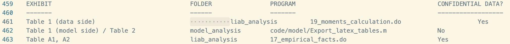

# Paper Identification

|           |                      |
|-----------|----------------------|
| ID        |  |
| Author    |    |
| Title     |     |
| Iteration |     |

Some useful information up front:

-   [JPE Data and Code Availability Policy](https://www.journals.uchicago.edu/journals/jpe/datapolicy)
-   [Step by step guidance from Data Editor for Authors](https://jpedataeditor.github.io/)
-   [Template README](https://social-science-data-editors.github.io/template_README/)

# Summary

In assessing compliance with our [Data and Code Availability Policy](https://www.journals.uchicago.edu/journals/jpe/datapolicy), our reproducibility team has identified the following issues, which we ask you to address:

1.  Data Editor's first point.
2.  Data Editor's second point.

# General

-   [x] Data Availability and Provenance Statements
    -   [x] Statement about Rights - Part 1: Right to use the data (e.g. *did the authors lawfully obtain the data*)
    -   [x] Statement about Rights - Part 2: Right to publish the data (e.g. *are human subjects involved and did permission been granted to publish their data?*)
    -   [x] License for Data (optional, but recommended)
    -   [x] Details on each Data Source
-   [x] Dataset list
-   [x] Computational requirements
    -   [x] Software Requirements
    -   [x] Controlled Randomness (as necessary)
    -   [x] Memory, Runtime, and Storage Requirements
-   [x] Description of programs/code
    -   [ ] License for Code (Optional, but recommended)
-   [x] List of tables and programs
-   [x] References (Optional, but recommended)

# High-level Description of Research Project

*This research project...*

-   [x] uses observational data.
-   [x] uses *confidential* observational data.
-   [ ] uses data generated via experiment or trial by the authors (in field or lab).
    -   [ ] For lab experiments: The code to implement the experimental protocol (z-Tree, o-Tree etc) is included in the package.
    -   [ ] A PDF copy of IRB approval is contained in the package.
    -   [ ] A PDF document outlining the design of the experiment, including information on the selection and eligibility of participants is included.
    -   [ ] A PDF copy of the instructions given to participants in both original language and an English translation is included.
-   [ ] uses data generated via survey by the authors (in field or online)
    -   [ ] The programs used to administer the survey (e.g. qualtrics survey file) are included.
    -   [ ] A PDF copy of IRB approval is contained in the package.
    -   [ ] A PDF of the original questionaire(s) and information on the selection and eligibility of participants is included.
-   [ ] is a simulation study: the data are generated by an algorithm.
-   [ ] is a numerical illustration: no data are used but code is used to produce illustrative output (tables, figures)

# Data description

## Data Sources

| file/name | public | private | DOI/URL | Access described | cited readme | cited paper |
|-----------|-----------|-----------|-----------|-----------|-----------|-----------|
| liab_lm_9314_v1_pers.dta (LIAB LM 9314) | no | yes | <https://fdz.iab.de> | yes | yes | yes |
| liab_lm_9314_v1_bhp_basis_v1.dta (LIAB LM 9314) | no | yes | <https://fdz.iab.de> | yes | yes | yes |
| iabbp\_<year>.dta (IAB Establishment Panel, 2004–2012) | no | yes | <https://fdz.iab.de> | yes | yes | yes |
| SIEED_7518_v1.dta | no | yes | <https://fdz.iab.de> | yes | yes | yes |
| SIEED_7518_v1_bhp_basis_v1.dta | no | yes | <https://fdz.iab.de> | yes | yes | yes |
| cpigermany.dta (Destatis CPI) | yes | no | <https://www-genesis.destatis.de/datenbank/online/statistic/61111/table/61111-0001> | yes | yes | yes |
| local labor markets.dta (Kropp & Schwengler concordance) | yes | no | \- | yes | yes | yes |
| Onet_Peri_Sparber_beruf_gr.dta | yes | no | <https://www.aeaweb.org/articles?id=10.1257/app.1.3.135> | yes | yes | yes |
| Validation_data.xlsx (aggregated IAB moments) | yes | no | \- | yes | yes | yes |
| World Bank WDI series (SL.GDP.PCAP.EM.KD, SP.POP.1564.TO, NY.GDP.PCAP.PP.CD, SP.POP.TOTL) | yes | no | <https://data.worldbank.org> | yes | yes | yes |
| WIOT2012_October16_ROW.dta (WIOD 2012 release) | yes | no | <https://www.rug.nl/ggdc/valuechain/wiod/wiod-2013-release> | yes | yes | yes |
| OECD CSVs (wages, hours, GDP, dependent employees, Germany 2019) | yes | no | <https://stats.oecd.org> | yes | yes | yes |

# Requirements

-   [x] README is in TXT, MD, or PDF format
-   [x] README is accessible at the root of the package (not inside a folder)
-   [x] Title conforms to guidance (starts with "Data and Code for: Title of Paper" or "Code for: Title of Paper", is properly capitalized)
-   [x] Authors (with affiliations) are listed in the same order as on the paper

## Stated Requirements

-   [ ] No requirements specified

-   [x] Software Requirements specified as follows:
    -   3.1 STATA
        - Stata 16 or later. (liab_analysis/prog/master.do declares `version 16`.)
        - User-written packages (install once from SSC):

                ssc install reghdfe        // high-dimensional fixed-effects regression
                ssc install ivreghdfe      // IV/2SLS version of reghdfe
                ssc install ftools         // dependency of reghdfe/ivreghdfe
                ssc install require        // package/version dependency checker  
                ssc install estout         // eststo / esttab / estout table export
                ssc install grstyle        // graph styling (model_analysis plots only)
                ssc install grc1leg2       // graph styling (model_analysis plots only)


            ivreghdfe additionally relies on ivreg2 and ranktest; if `ssc install
            ivreghdfe` does not pull them in, install them as well:
                ssc install ivreg2
                ssc install ranktest

            The do-files in calibration_external/ use base Stata only (import Excel,
            merge, collapse) and require none of the above.


        Also, make sure to add the ado files bartik_weight.ado, btsls.ado, and ch_weak.ado, which are not available via ssc install.
        The codes can be downloaded directly at https://github.com/paulgp/bartik-weight/tree/master/code


        3.2 MATLAB
        - MATLAB (R2019b or later recommended) with the Optimization Toolbox.
            The model solution and calibration use fsolve and fminsearch; the
            nu-estimation helper files in liab_analysis/prog use fsolve and gamma().
        - No additional MATLAB toolboxes are required.

-   [x] Computational Requirements specified as follows:

    -   3.4 MEMORY AND STORAGE REQUIREMENTS

        Restricted-data Stata analysis (liab_analysis, sieed_analysis):
        All computations on the confidential data are carried out on the
        servers of the FDZ. Replicators therefore do not need to provision
        memory or storage for this part of the analysis.

        MATLAB model (model_analysis) and MATLAB helper files:
        The structural model is small and runs on any standard computer capable
        of running MATLAB itself. A machine meeting
        MathWorks' standard recommendation of 8 GB of RAM is more than
        sufficient. Model_analysis requires under 15 MB in total. 

-   [x] Time Requirements specified as follows:

    -   3.3 RUN TIME AND REPRODUCIBILITY
        - Run time is data-dependent. The empirical part of the model takes close to 5 hours to run on the full data.
            On the genuine FDZ data, the bootstrap-based
            do-files (5,000 firm-clustered draws) and the model calibration (SMM via
            fminsearch) are the slow steps.
        - Seeds are set (set seed 1234 in Stata; explicit bootstrap seeds were used).
        - With the shipped TEST data the code runs to completion but outputs WILL NOT
            match the paper.

-   [ ] Requirements are complete.

For missing requirements, see the list of required changes in @sec-findings

# Analyzing Data and Code Files











## Code description

There are 34 `.do` files. 1 master file at the root, 1 fileint he calibration_external folder, 20 for the liab_analysis, 7 for the sieed_analysis, 1 for the model_analysis, and 4 for the stat_plots. 

There are 50 `.m` files. 1 master file int he model_analysis, 2 files in the liab_analysis, 1 to export the latex tables, 19 for the heterogeneous-firm model, 15 for the homogeneous (within-sector) model, and 12 for the policy counterfactuals.

The below table presents programs which produce figures or tables.

| Exhibit | Folder | Program |
|---|---|---|
| Table 1 | liab_analysis | 19_moments_calculation.do |
| Table 1 (model side) / Table 2 | model_analysis | code/model/Export_latex_tables.m |
| Tables A1, A2 | liab_analysis | 17_empirical_facts.do |
| Tables A3–A5 | sieed_analysis | 2a_results_event_studies.do |
| Tables A6–A8 | liab_analysis | 18_immigrant_comparative_advantage.do |
| Table C1 | liab_analysis | 10_epsilon_estimation.do |
| Tables C2, C4 | liab_analysis | 15_epsilon_shift_share.do |
| Table C3 | liab_analysis | 11_epsilon_pre_trend_test.do |
| Table C5 | liab_analysis | 12_epsilon_firm_characteristics.do |
| Table C6 | liab_analysis | 16_estimate_nu.do (+ MATLAB nu files) |
| Table C7 | liab_analysis / model_analysis | 19_moments_calculation.do / Export_latex_tables.m |
| Tables C8–C13 | liab_analysis | 8_validation_regressions.do |
| Tables D1–D3 | model_analysis | code/model/Export_latex_tables.m |
| Kappa (Appendix C.1) | liab_analysis | 9_kappa_estimation.do |
| Figure 1 | liab_analysis | 17_empirical_facts.do |
| Figure 2 | sieed_analysis | 2a_results_event_studies.do |
| Figure 3 | liab_analysis / model_analysis | 8_validation_regressions.do / master.do (Validation_cross_CI_heterog.do) |
| Figure 4 | model_analysis | master.do (Counterfactual_plots_heterog.do) |
| Figures A1–A4, A6 | liab_analysis | 17_empirical_facts.do |
| Figure A5 | sieed_analysis | 2c_results_figA5.do |
| Figure A7 | sieed_analysis | 2b_results_figA7.do |
| Figure A8 | sieed_analysis | 2a_results_event_studies.do |
| Figure A9 | liab_analysis | 18_immigrant_comparative_advantage.do |
| Figure C1 | liab_analysis | 14_epsilon_sigma_histogram.do |
| Figures D1, D2 | model_analysis | master.do (Counterfactual_plots_policies.do) |
| Calibration moment GDP_RoW_Ger (~0.32) | calibration_external | gdp_per_worker_*.do |
| Calibration moment tradeable share (~0.68) | calibration_external | tradeable_consumption_share.do |



-   [x] The replication package contains a "main" or "master" file(s) which calls all other auxiliary programs.

> NOTE: In-text numbers that reference numbers in tables do not need to be listed. Only in-text numbers that correspond to no table or figure need to be listed.

## Computing Environment of the Replicator

- Macbook Air 2020
- Apple M1 Chip
- 8 GB RAM
- Mac OS Tahoe 26.5.2
- StataMP 19.5
- Matlab R2026a

# Replication

Overall the script runs smoothly with 1 issue. 

When running the file, an error appeared related to permissions:

```
. log using "${log}/master.log", replace
(file
    /Users/mac/JPE-replications/JPE-Morales-20211186/replication-package/Brinatti_Morales_Replic
    > ation_Package/liab_analysis/log/master.log not found)
file
    /Users/mac/JPE-replications/JPE-Morales-20211186/replication-package/Brinatti_Morales_Replic
    > ation_Package/liab_analysis/log/master.log could not be opened
r(603);
```

Solution:

```
I ran a background command (chmod -R u+w) on the entire Brinatti_Morales_Replication_Package folder to grant write permissions for all files inside it.
```

After fixing, another error appeared:

```
mvnrnd requires Statistics and Machine Learning Toolbox.
Error in Heterogeneity (line 56)
normal_draw    = exp(mvnrnd(mu,    var,    N_g));
^^^^^^^^^^^^^^^^^^^^^^^^^^^^^^^^^^^^^^^^^^^^^^^^^
Error in Counterfactual_heterogeneous_open (line 14)
SS      = Heterogeneity(PP);
^^^^^^^^^^^^^^^^^^^^^^^^^^^^
Error in run (line 100)
evalin('caller', strcat(scriptStem, ';'));
^^^^^^^^^^^^^^^^^^^^^^^^^^^^^^^^^^^^^^^^^^
Error in master>run_isolated (line 100)
    run(script_name);
    ^^^^^^^^^^^^^^^^^
Error in master (line 33)
run_isolated('Counterfactual_heterogeneous_open.m');
^^^^^^^^^^^^^^^^^^^^^^^^^^^^^^^^^^^^^^^^^^^^^^^^^^^^
Error in run (line 100)
evalin('caller', strcat(scriptStem, ';'));
^^^^^^^^^^^^^^^^^^^^^^^^^^^^^^^^^^^^^^^^^^
}
```

After installing Machine Learning Toolbox in Matlab, the code ran to completion.


# Findings {#sec-findings}

## Missing Requirements

The provided test data took approximately 1 hour to run on the replicator's machine (Stata analysis: ~48 minutes, MATLAB model: ~8 minutes). Please add this information to the README.

> \[REQUIRED\] Please amend README to contain complete requirements.

## Data Preparation Code

The master file `master_file.do` ran without issues after installing the Statistics and Machine Learning Toolbox in Matlab.

## Tables and Figures

| Exhibit | Folder | Program | Reproduced? | Comment |
|---|---|---|---|---|
| Table 1 | liab_analysis | 19_moments_calculation.do | yes | rounding discrepancy on the $\sigma_{\psi, f, NT}$ which equals 30.82 in the paper and 30.83 in the reproduced file. |
| Table 2 | model_analysis | code/model/Export_latex_tables.m | yes | - |
| Tables A1, A2 | liab_analysis | 17_empirical_facts.do | yes | differences appear because of confidentiality of the data |
| Tables A3–A5 | sieed_analysis | 2a_results_event_studies.do | yes | differences appear because of confidentiality of the data |
| Tables A6–A8 | liab_analysis | 18_immigrant_comparative_advantage.do | yes | differences appear because of confidentiality of the data |
| Table C1 | liab_analysis | 10_epsilon_estimation.do | yes | differences appear because of confidentiality of the data |
| Tables C2, C4 | liab_analysis | 15_epsilon_shift_share.do | yes | differences appear because of confidentiality of the data |
| Table C3 | liab_analysis | 11_epsilon_pre_trend_test.do | yes | differences appear because of confidentiality of the data |
| Table C5 | liab_analysis | 12_epsilon_firm_characteristics.do | yes | differences appear because of confidentiality of the data |
| Table C6 | liab_analysis | 16_estimate_nu.do (+ MATLAB nu files) | yes | differences appear because of confidentiality of the data |
| Table C7 | liab_analysis / model_analysis | 19_moments_calculation.do / Export_latex_tables.m | yes | rounding discrepancies (paper vs reproduced file). $Var((1-s_j)/s_j)$, T: simulated 1.31 vs 1.32 $Var((1-s_j)/s_j)$, NT: simulated 1.43 vs 1.42 data 1.58 vs 1.59. $E(1-s_{j,p90})-E(1-s_{j,p50})$, T: simulated 0.027 vs 0.026. Share of firms hiring immigrants, T: simulated 0.62 vs 0.61.|
| Tables C8–C13 | liab_analysis | 8_validation_regressions.do | yes | differences appear because of confidentiality of the data |
| Tables D1–D3 | model_analysis | code/model/Export_latex_tables.m | yes | - |
| Kappa (Appendix C.1) | liab_analysis | 9_kappa_estimation.do | yes | differences appear because of confidentiality of the data |
| Figure 1 | liab_analysis | 17_empirical_facts.do | no | No image files produced by code; only underlying data tables. |
| Figure 2 | sieed_analysis | 2a_results_event_studies.do | no | No image files produced by code; only underlying data tables. |
| Figure 3 | liab_analysis / model_analysis | 8_validation_regressions.do / master.do (Validation_cross_CI_heterog.do) | yes | differences appear because of confidentiality of the data |
| Figure 4 | model_analysis | master.do (Counterfactual_plots_heterog.do) | yes | -|
| Figures A1–A4, A6 | liab_analysis | 17_empirical_facts.do | no | No image files produced by code; only underlying data tables. |
| Figure A5 | sieed_analysis | 2c_results_figA5.do | no | No image files produced by code; only underlying data tables. |
| Figure A7 | sieed_analysis | 2b_results_figA7.do | no | No image files produced by code; only underlying data tables. |
| Figure A8 | sieed_analysis | 2a_results_event_studies.do | no | No image files produced by code; only underlying data tables. |
| Figure A9 | liab_analysis | 18_immigrant_comparative_advantage.do | no | No image files produced by code; only underlying data tables. |
| Figure C1 | liab_analysis | 14_epsilon_sigma_histogram.do | yes | differences appear because of confidentiality of the data |
| Figures D1, D2 | model_analysis | master.do (Counterfactual_plots_policies.do) | yes | - |
| Calibration moment GDP_RoW_Ger (~0.32) | calibration_external | gdp_per_worker_*.do | yes | differences appear because of confidentiality of the data |
| Calibration moment tradeable share (~0.68) | calibration_external | tradeable_consumption_share.do | yes | differences appear because of confidentiality of the data |


## In-Text Numbers

-   [ ] In-text numbers not verified.

-   [ ] There are no in-text numbers, or all in-text numbers stem from tables and figures.

-   [ ] There are in-text numbers, but they are not identified in the code

-   [x] The below in-text numbers have been verified. 

*Section 6.1 aggregates and dollar gains*

"that the welfare of native workers would increase by 0.11%, representing $1.8 billion for
the aggregate economy."

(...)

"The welfare gains of firm owners (1.31%) are larger than those of native workers"

(...)

"Total income, which includes earnings for all workers and profits, increases by 1.28% or $22.5 billion."

*Section 6.3 decomposition* 

"which is 9% (0.010 pp) larger than "

(...)

"implying that terms-of-trade effects reduce the gains from immigration by 0.004 pp (approximately 39% of the total dampening effect)." 

(...)

"The remaining 61% of the total dampening effects (0.006 pp) is due to the heterogeneity
in immigrant shares across firms within sectors, as illustrated in equation 16."

## Other Issues

- In Instructions to Replicators, please add the info that if Matlab is added to PATH, everything can be replicated using master_file.do
- There’s no info on where the .ado files should be located
- The package should be unzipped directly to `replication-package` folder
- There is no paper in the paper-appendices folder, please relocate
- Please provide the file in open format:  `model_analysis/data/inputs/Validation_data.xlsx`
- There’s an unnecessary tabulate in readme in table line 459 (look at the screenshot)




# Classification

-   [ ] full reproduction
-   [ ] full reproduction with minor issues
-   [x] partial reproduction (see above)
-   [ ] not able to reproduce most or all of the results (reasons see above)

## Reason for incomplete reproducibility

-   [ ] None.
-   [ ] `Discrepancy in output` (either figures or numbers in tables or text differ)
-   [x] `Bugs in code` that were fixable by the replicator (but should be fixed in the final deposit)
-   [ ] `Code missing`, in particular if it prevented the replicator from completing the reproducibility check
    -   [ ] `Data preparation code missing` should be checked if the code missing seems to be data preparation code
-   [ ] `Code not functional` is more severe than a simple bug: it prevented the replicator from completing the reproducibility check
-   [ ] `Software not available to replicator` may happen for a variety of reasons, but in particular (a) when the software is commercial, and the replicator does not have access to a licensed copy, or (b) the software is open-source, but a specific version required to conduct the reproducibility check is not available.
-   [ ] `Insufficient time available to replicator` is applicable when (a) running the code would take weeks or more (b) running the code might take less time if sufficient compute resources were to be brought to bear, but no such resources can be accessed in a timely fashion (c) the replication package is very complex, and following all (manual and scripted) steps would take too long.
-   [ ] `Data missing` is marked when data *should* be available, but was erroneously not provided, or is not accessible via the procedures described in the replication package
-   [x] `Data not available` is marked when data requires additional access steps, for instance purchase or application procedure.
-   [ ] `Missing README` is marked if there is no README to guide the replicator, or the README is not in compliance with JPE requirements

